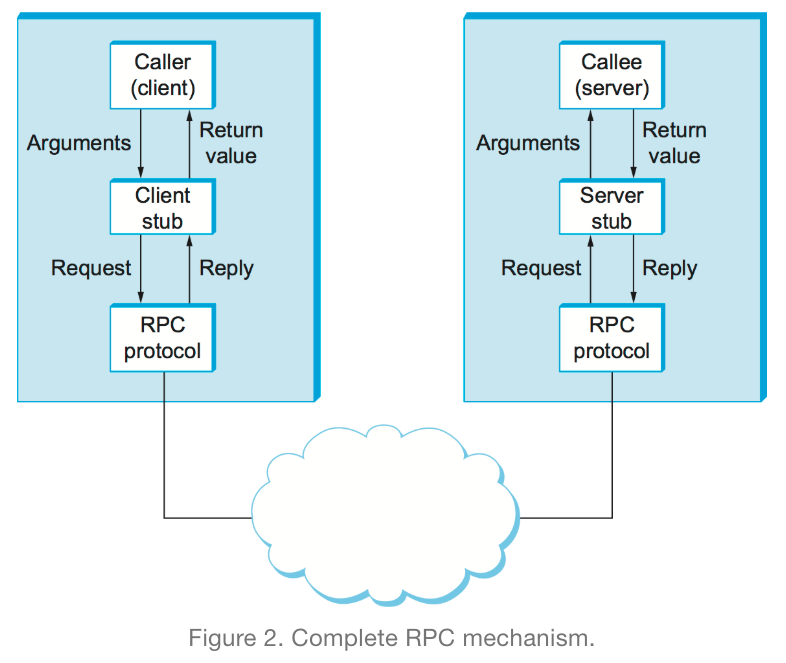
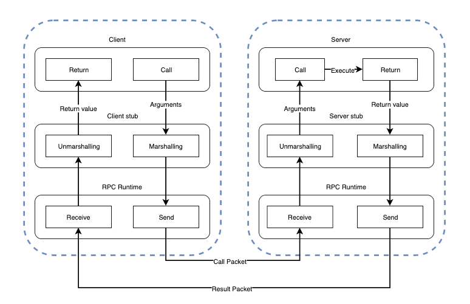
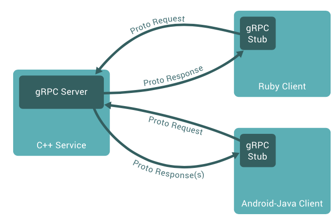

# gRPC

## RPC (Remote Procedure Call)

프로그램이 네트워크의 세부 정보를 이해하지 않아도 (별도 원격 제어 위한 프로그래밍 없이도) 네트워크 내 다른 컴퓨터의 프로그램에서 서비스를 요청하는 프로토콜로, Client-Server 모델을 사용하고 클라이언트에서 서비스를 요청하면 서버에서 서비스를 제공하는 형태.

일반적으로 프로세스는 자신의 주소 공간 내에 존재하는 함수만 호출하여 실행 가능하지만, RPC의 경우 네트워크를 통한 메시징을 수행하기 때문에 자신과 다른 주소 공간에서 동작하는 프로세스의 함수 또한 실행 가능하다.




- 구현체
    - Google ProtoBuffer
    - Facebook Thrift
    - Twitter Finalge


## IDL (Interface Definition Language)

어느 한 언어에 국한되지 않는 언어 중립적 방법으로 인터페이스를 표현함으로써 정의 언어 → 구현 언어 (e.g. C / C++ / Java) 로의 Mapping 지원
XML 과 JSON도 IDL의 일종이다.
XML의 문제점 개선 + 월등한 성능을 위해 Protocol Buffers가 고안되었으며 이는 주로 gRPC에서 사용된다.


## Protocol Buffers
- Structured Data를 Serialization하기 위한 프로토콜로 XML보다 작고 빠르고 간단하다.
- .proto extension 파일에 Protocol Buffer의 세가지 타입을 정의한다.

- 장점
    - 간단함
    - 파일 크기가 작다 (약 3~10배)
    - 속도가 빠르다 (약 20~100배)
    - XML보다 가독성이 좋고 명시적이다
    - proto2 / proto3 두 가지 타입이 있다. (proto3 사용 권장)

```proto
syntax = "proto3";
 
package sample.idl.proto;
 
option java_package = "sample.demo";
option java_outer_classname = "DemoProtos";
option java_multiple_files = true;
 
service DemoGreeting {
    rpc greetMember(GreetRequest) returns (GreetResponse);
}
 
message GreetRequest {
    string name = 1;
}
 
message GreetResponse {
    string greetings = 1;
}
```

## gRPC?
- Google 에서 개발한 RPC
- TCP/IP & HTTP 2.0 프로토콜 사용
- IDL (Interface Definition Language) 로 Protobuf 사용

